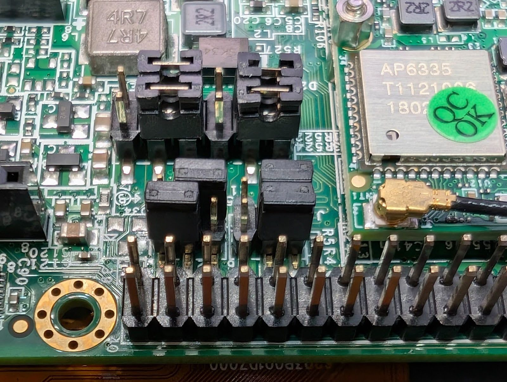
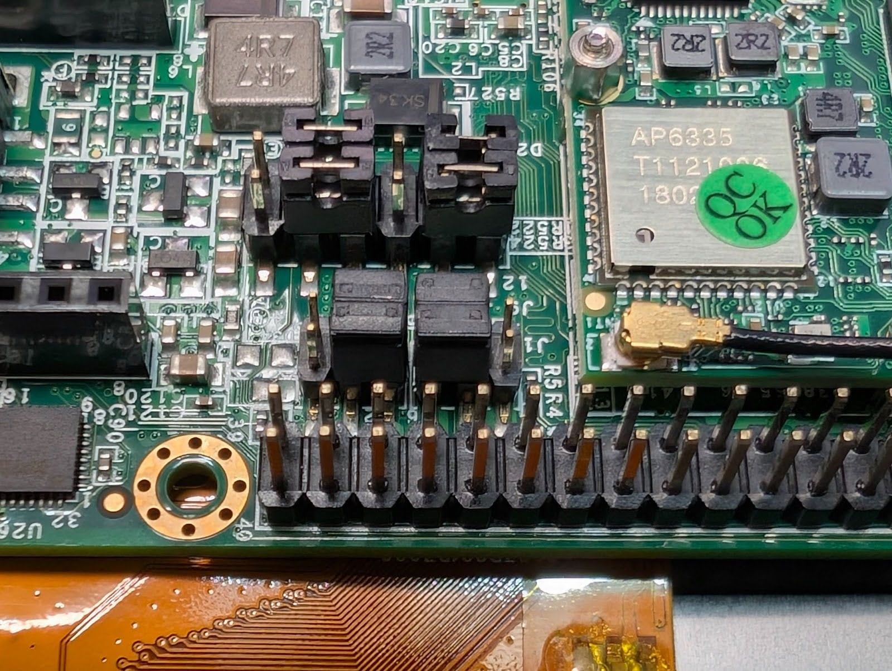

# Pico i.MX7 Ubuntu 22.04 Wi-Fi and camera modules

This repository builds and packages six modules for the inspected TechNexion
Pico i.MX7 Ubuntu 22.04 image (kernel `5.15.71`): AP6335 BCM4339 Broadcom
FullMAC SDIO Wi-Fi and the vendor CAM-OV5645 MIPI-camera stack. It includes a prebuilt set in
[`prebuilt/pico-imx7/ubuntu-22.04-5.15.71`](prebuilt/pico-imx7/ubuntu-22.04-5.15.71),
but you can rebuild it from source.

## TL;DR

```bash
./fetch-base-image.sh
# This may require sudo password due to guestfish.
./make-image.sh

# Set the jumpers to USB boot
./flash-emmc.sh --flash

# Set the jumpers to eMMC boot and boot the computer normally
```

## Create a flash image

The base image is intentionally not committed. Obtain the exact raw image with
SHA-256 `9fb5d12f5f50167d5529979b86fad7fcba454ea5b8e984feb43f2446c0e6f3ed`.

```bash
sudo apt install --no-install-recommends curl xz-utils
sudo apt install --no-install-recommends kmod libguestfs-tools
./fetch-base-image.sh
./make-image.sh
```

This fetches pinned AP6335 firmware and NVRAM, uses the tracked prebuilt
modules, and writes `pico-imx7-ubuntu-22.04-brcm.raw` plus provenance under
`artifacts/ubuntu-22.04/`.
It tries `guestfish` without privilege first. If the host kernel is unreadable
to its helper VM, it requests your `sudo` password, retries with elevation, and
hands ownership of its temporary archives back to you. The script does not
modify `/boot`; the downloaded base image and new output remain handled as your
normal user.

## Rebuild the modules

Install the kernel build tools, then run the builder. GCC 12 is required; GCC
14 does not build this tree.

```bash
sudo apt install --no-install-recommends bc dwarves gcc-12-arm-linux-gnueabi libelf-dev
./build-drivers.sh
```

The scripts keep the kernel checkout and build output in `artifacts/`.

## Access the inspected target

Connect to the board with:

```bash
./scripts/ssh-technexion.sh
```

The helper uses `sshpass` to connect noninteractively to `ubuntu@technexion`.
The password is `ubuntu`; it is intentionally non-sensitive and may be used or
recorded in clear text for this inspected development target. Every invocation
is bounded to 120 seconds (including connection setup) and kills a stuck SSH
client after a 10-second grace period. Override the limit for a known long
command with `SSH_TECHNEXION_TIMEOUT_SECONDS=300`.

## Verify the camera on the target

The camera binds at `/dev/video1`, but capture is not yet validated: recent
on-device tests produced corrupted frames and unstable repeated capture. See
[the current investigation](docs/camera-investigation.md) before testing.
List its modes and use this bounded diagnostic:

```bash
v4l2-ctl -d /dev/video1 --list-formats-ext
timeout 15 v4l2-ctl -d /dev/video1 \
  --set-fmt-video=width=640,height=480,pixelformat=YUYV \
  --stream-mmap=3 --stream-count=30 --stream-to=capture.raw
```

## Build an image from rebuilt modules

Image creation also requires `guestfish` and `depmod`, supplied by
`libguestfs-tools` and `kmod` respectively. Install them first if you did not
already run the prebuilt-image command above:

```bash
sudo apt install --no-install-recommends kmod libguestfs-tools
./make-image.sh --rebuilt --output-name pico-imx7-ubuntu-22.04-rebuilt.raw
```

## Flash an SD card

First use the dry run and confirm the device independently:

```bash
./flash-sd-card.sh --device /dev/sdX
```

It prints two confirmation strings. Repeat the command with `--flash` and both
exact confirmations to write the whole, unmounted card. Do not use a partition
such as `/dev/sdX1`.

## Flash eMMC over USB

Fetch the pinned TechNexion UUU package and its matching Pico i.MX7 boot
assets, then set the board DIP switches to USB boot and connect its USB OTG
port. The script confirms the expected NXP USB identity (`MX7D SDP`,
`15a2:0076`) and is dry-run by default:

```bash
sudo apt install --no-install-recommends curl unzip
./fetch-emmc-boot-assets.sh
./flash-emmc.sh
```

### PICO-PI-IMX7 boot-jumper positions

These are **four 3-pin jumper caps**, not the expansion-header pins or other
switches. Use [Figure 19 of the PICO-PI-IMX7 hardware manual](https://www.nxp.com/docs/en/user-guide/PICO-IMX7UL-USG.pdf#page=18)
as the physical reference: with the 40-pin expansion header along the top of
the photo, the 2×2 boot-control cluster is directly **below** it and to the
right of the Wi-Fi module. The manual's **right-hand** photo is the
required Serial Boot Loader (USB download) configuration; its **left-hand**
photo is normal eMMC boot. Match the four caps to the photograph exactly.

Direct links: [boot-control photograph (Figure 19, page 18)](https://www.nxp.com/docs/en/user-guide/PICO-IMX7UL-USG.pdf#page=18) · [full PICO-PI-IMX7 hardware manual](https://www.nxp.com/docs/en/user-guide/PICO-IMX7UL-USG.pdf).

`**-` bridges the two pins on the left of one three-pin jumper; `-**` bridges the two on the right.

```text
Serial Boot Loader (USB):       Normal eMMC boot:
top row:     -**  **-           top row:     **-  -**
bottom row:  -**  **-           bottom row:  **-  **-
```

#### eMMC mode (normal)


#### USB boot (flash)


Power the board off before moving the caps. Use the USB-C OTG/power connector
for the host data cable; the micro-USB connector is the serial-console
interface. Before flashing, `lsusb -d 15a2:0076` must show one device.

See [the detailed Ubuntu workflow](docs/workflows/ubuntu.md) for provenance,
configuration extraction, and validation details.
